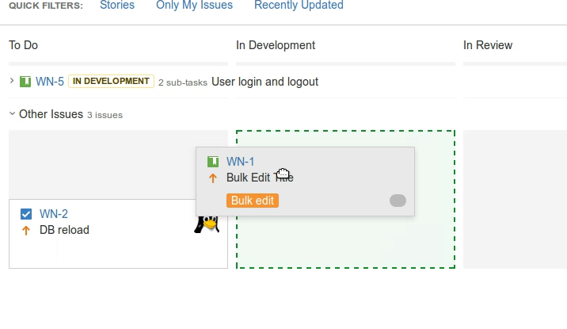
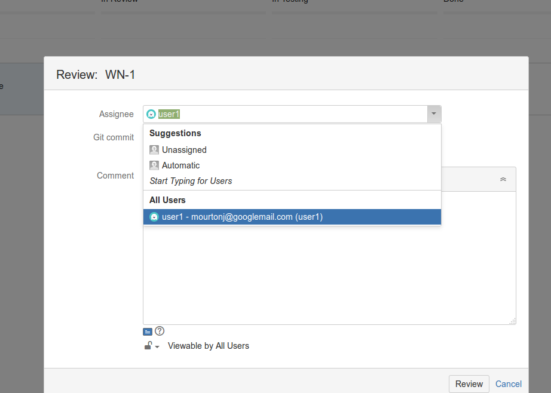

#Development Process

### 1) PM/Team Defines Sprint Scope

### 2) Developer starts a story (Jira)
 

### 3) D. creates a feature branch, sets Story ID
	git fetch
	git co -b story/search-product-titles origin/development
	set-story

### 4) D. makes comits on the feature branch, pushes regularly
others are free to merge as needed

	git fetch
	git merge story/search-product-titles

### 5) D. completes the code, assigns it for review
- Git: merge with dev. HEAD (or rebase)
- Jira: Drag task to the "Review" column
- Assign it to the reviewer
- paste in git commit (or pull request URL...)

eg:

	git fetch
	git merge origin/develop

 

### 6) D. starts working on the next story
- branch from development HEAD
- merge unreviewed code if needed

eg:

	git co -b story/NEW-ONE origin/development
	git merge search-product-titles

### 7) Reviewer reviews the code
- When OK then move it to "Testing" colomn in Jira

### 8) QA Tests the story
- Jira: drags issue to Done or ToDo (Pass / Fail transition)
- or creates a bug issue
1
2
