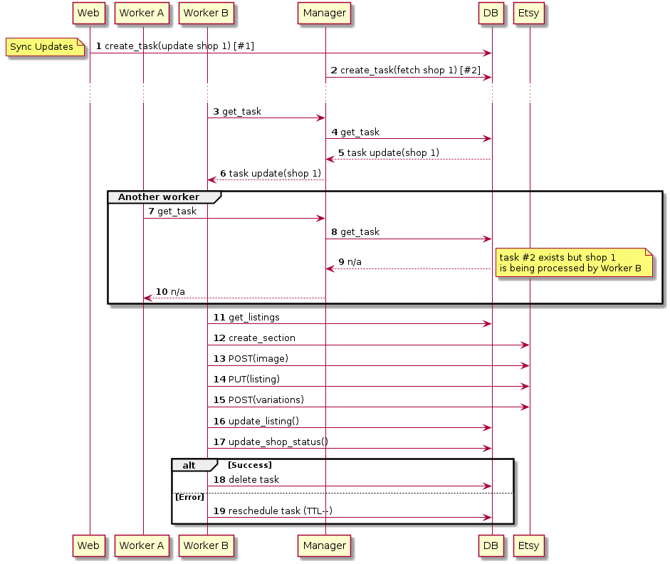

# Vela Single-Worker Architecture

## Key Features of the Proposal

- Simplicity - easy to implement & maintain
- No single point of failure - get rid of the manager
- Scalability - by adding more workers

## Functional Requirements

- regular sync shop from etsy
- on-demand sync shop from etsy
- push changes to etsy
- task/sec quota
- task/24hrs quota
- reporting: current status of a shop , sync progress
- prioritization - on-demand sync before regular

## Approach

- Single shop will be managed by one worker only
	- pre second quota throttling will be managed by that single process; no tokens/buckets/locking etc. is necessary
- there will be only top-level tasks managed by the system (stored in the db)
task types:
	- regular_download (lower priority)
	- forced_download (higher priority)
	- upload_changes (high p.)
- detailed "tasks" (as used today) would be just function calls of the worker business logic

## Basic Workflow

- Web (or another component) will create a task like 'upload_changes' in the db.
- Idle Worker will fire REST call "get-task" to Task_manager (used here to limit number of DB connections and throttle db quieries), it will query the DB to get task:
	- highest priority
	- not scheduled for some later time
	- related to a shop not being processed at the moment
- The DB will mark the task as 'being processed by worker XY. shop Z'
- Worker starts working on the tasks - The business logic (e.g. what exactly needs ti be done to 'upload changes') will be handled by the worker.
During the process it:
	- updates shop record (to_upload, to_downoad ...)
	- updates products (new data, timestamps...)
- On success it deletes the completed task from the DB
- On error - reschedule the task to later try
	- based on task type and TTL: (e.g 3 min, 20 min, 3 hrs, 24 hrs)

 

### Cleanup
Scheduled job will regularly remove (re- schedule?)  tasks that are 'in progress' for a long time and no actual worker is working on them (crashed)

## Sync Updates Call Flow
 

***
### Notes

**visibility into task status**

- what is the current status of the shop? -> shop table [up_to_date | syncing...], listings_to_upload
- something failed: what went wrong? -> logstash reports (or equiv. solution) where we'd have both - last sync problems with drill down capabilities, and statistics (num of shops affected, frequency, trend...)
I don't think task queue is the right place to store this kind of info

**death of workers/components**

- always needs to be handled somehow (imho), for flat high-level task queue it is fairly simple

**buffer servers for polling db**

- simple, few lines of code; other options include Listen/Notify callback interface (haven't tried though)

**when are shops ready for syncing?**

- a worker queries one of the managers (REST), which then calls the stored proc. (DB) to request a new task (or we could use rabbitMQ for it)

**API calls made by the worker are asynchronous**

- the worker knows the logic of e.g. "pushing changes to etsy", it knows what can run in parallel and what needs to be in sequence. Where our approaches differ is that I claim that it is sufficient to use standard JS features (promises, async await) for what we need.
- The MQ architecture is good by all means, I'm just not convinced that the additional complexity is justifiable for our case (we are not google).

**Rate limit**

- Shop download with per sec. quota limit example:  https://github.com/tomasji/temp/blob/async-download/src/worker/worker.js
the example above - apiCallWithQuota()   - utilizes the fact that JS is single threaded; keeps array of 30 calls in memory array.
