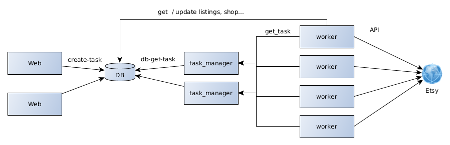

# Vela Single-Worker Architecture

## Key Features of the Proposal

- Simplicity - easy to implement & maintain
- No single point of failure - get rid of the manager
- Scalability - by adding more workers

## Functional Requirements

- regular sync shop from etsy
- on-demand sync shop from etsy
- push changes to etsy
- task/sec quota
- task/24hrs quota
- reporting: current status of a shop , sync progress
- prioritization - on-demand sync before regular

## Approach

- Single shop will be managed by one worker only
	- pre second quota throttling will be managed by that single process; no tokens/buckets/locking etc. is necessary
- there will be only top-level tasks managed by the system (stored in the db)
task types:
	- regular_download (lower priority)
	- forced_download (higher priority)
	- upload_changes (high p.)
- detailed "tasks" (as used today) would be just function calls of the worker business logic

## Basic Workflow

- Web (or another component) will create a task like 'upload_changes' in the db.
- Idle Worker will fire REST call "get-task" to Task_manager (used here to limit number of DB connections and throttle db quieries), it will query the DB to get task:
	- highest priority
	- not scheduled for some later time
	- related to a shop not being processed at the moment
- The DB will mark the task as 'being processed by worker XY. shop Z'
- Worker starts working on the tasks - The business logic (e.g. what exactly needs ti be done to 'upload changes') will be handled by the worker.
During the process it:
	- updates shop record (to_upload, to_downoad ...)
	- updates products (new data, timestamps...)
- On success it deletes the completed task from the DB
- On error - reschedule the task to later try
	- based on task type and TTL: (e.g 3 min, 20 min, 3 hrs, 24 hrs)

 

### Cleanup
Scheduled job will regularly remove (re- schedule?)  tasks that are 'in progress' for a long time and no actual worker is working on them (crashed)

